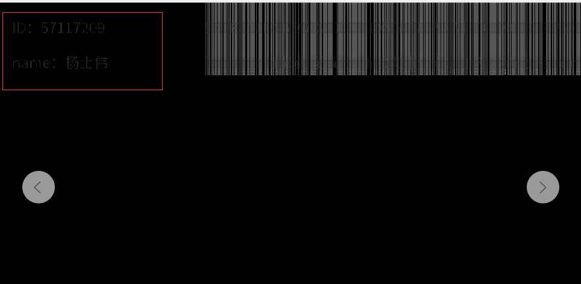

# Hiding in Frequency


## 一、Hide the information to the picture


### 1、Prepare the original picture and the information to be hidden

- **orig.png**

  

- **myinfo.png**

  


### 2、Use blind watermarking to hide information

```bash
python encode.py --image orig.png --watermark myinfo.png --result result.png
```

- **result.png**

  


## 二、Extract the information from picture

```bash
python decode.py --image result.png --orig orig.png --result watermark_result.png
```

- **watermark_result.png**

  

  


